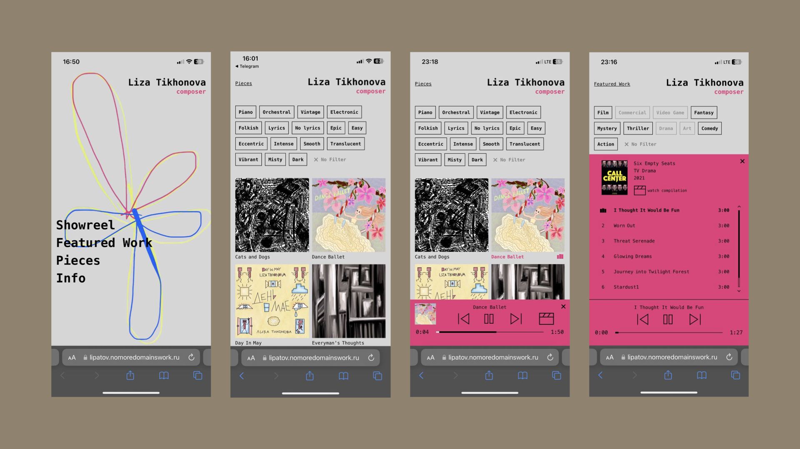

# Music Composer Portfolio App

## Desc

A platform for a composer to showcase her music. The platform is highly efficient, relying exclusively on TypeScript and React without utilizing any other third-party libraries.

## Tech

- React
- TypeScript
- HTML Audio

## Highlights

- Custom implementation of virtualization, throttling, mobile scroll, and audio player interface with buffering.
- Optimizations for mobile devices according to Web Vitals.
- Mobile-first approach.

[Link to the application](https://lipatov.nomoredomainswork.ru/)
